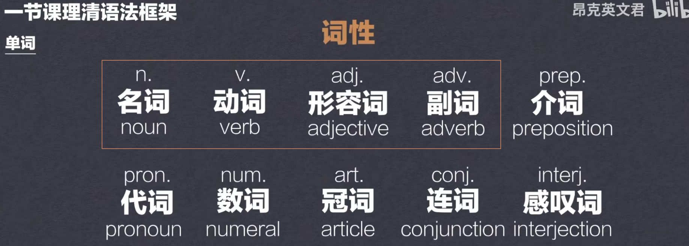
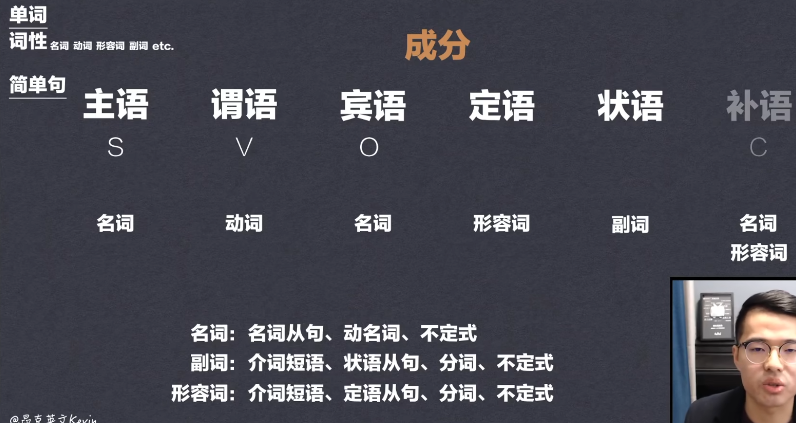
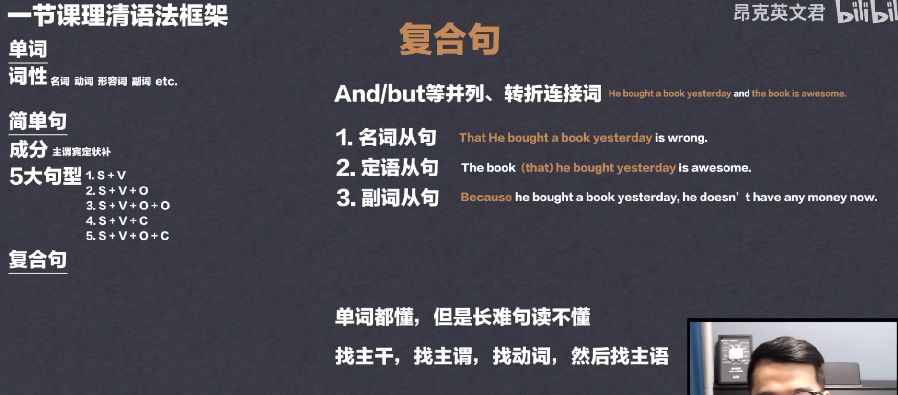
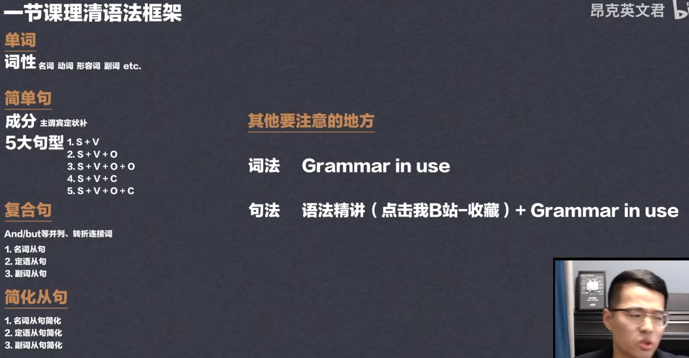

# overview

## 主语

**解释： 动作发起者**

## 谓语

**主语所发出的行为、动作等**

## 宾语

**动作的承受者**

## 定语

**修饰名词或代词的成分就是定语**

## 状语

**用来修饰动词、形容词、副词或整个句子的成分。主要由副词担任。此外，形容词、介词短语、名词词组、动词不定式短语也可以作状语。状语有分时间状语、地点状语、原因状语、条件状语、目的状语、方式状语、让步状语、情况状语**

## 补语

## 表语

**说明主语的状态、性质、等** **（am,is,are,was,were,have been）系动词之后**

# 昂克英语grammer

#### 词性

#### 成分

#### 复合句

#### 总结

