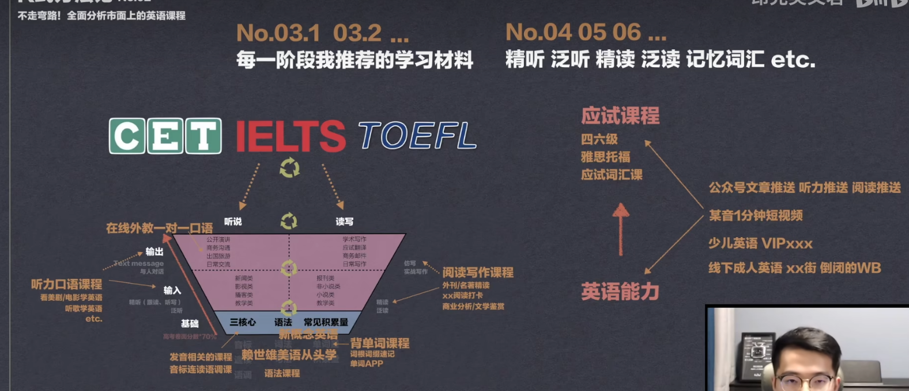
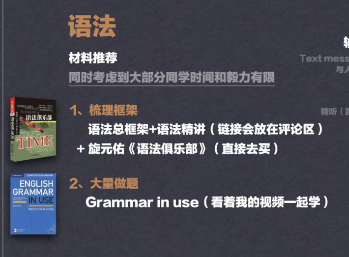
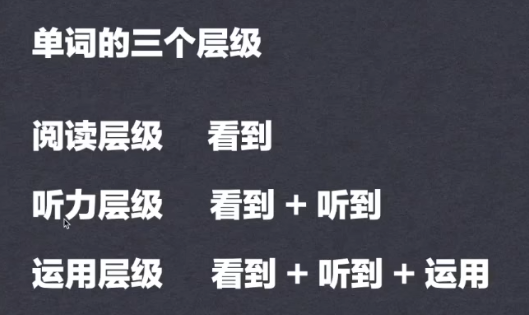
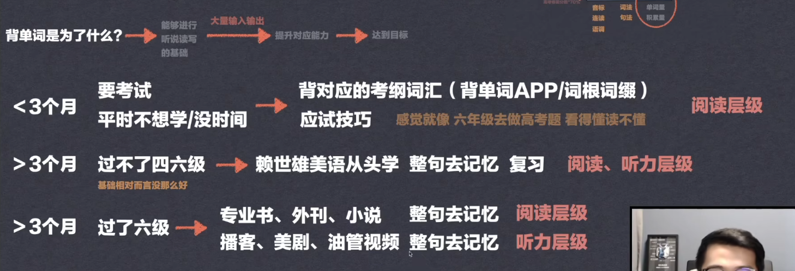
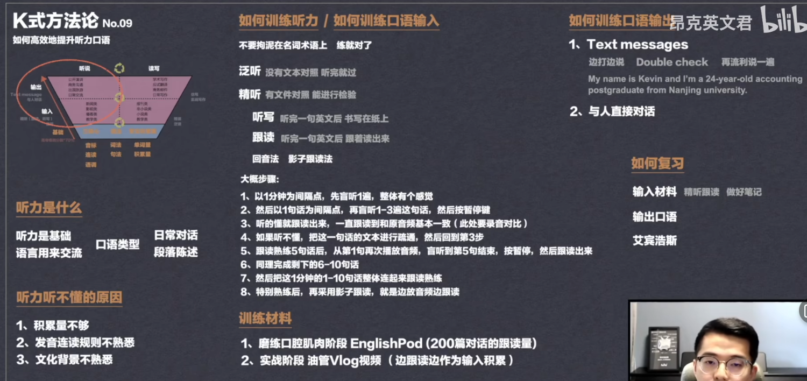
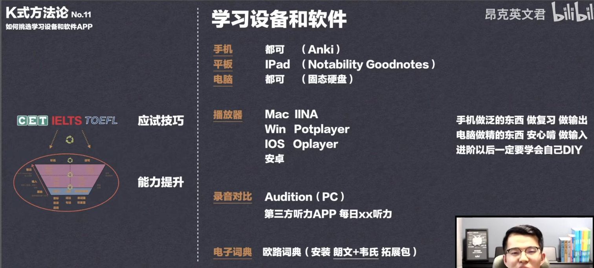

### 核心点

**基础扎实 大量输入 大量输出**

#### 基础

- 发音三核心： 
  - 音标： 听力识别度 发音准确 交流清晰
  - 连读： 听力识别度 地道 流利度 提高听力能力
  - 语调： 让对方更好理解
- 语法：
  - 词法
  - 句法
- 常见积累量
  - 单词量： 阅读层面 听力层面 运用层面
  - 积累量： 单词量 短语 句子

#### 输入

**听说**

- 精听： 跟读 听写
- 泛听

**读写**

- 精读
- 泛读

#### 输出

**听说**

- text message
- 与人对话

**读写**

- 仿写
- 实战写作

**num1:**

**num2:**

### 教材推荐

#### 三核心

##### 发音

##### 连读

##### 语调

#### 语法

#### 词汇

#### 听力

#### 阅读和写作

#### 学习软件推荐

