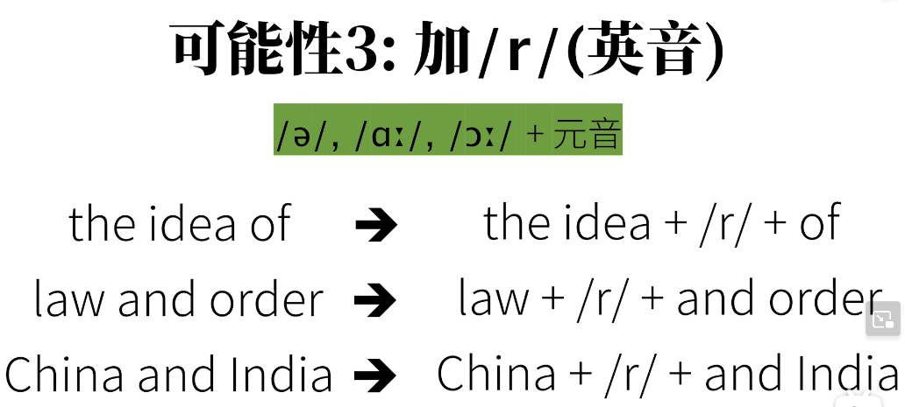
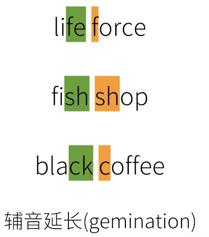

### number1

###### 001g

1. deep <---> shallow /ˈʃælo/  

   However, these relationships are often quite  /kwaɪt/  shallow  然而，这些关系往往很肤浅

2. He represents you in the meeting   ==  He is **attending** the meeting on your behalf.  

3. current <---> legacy 

   The current system supports modern  /'mɑdɚn/ encryption methods, while the legacy system relies on outdated  /ˌaʊtˈdetɪd/  algorithms.  当前系统支持现代加密方法，而遗留的系统则依赖于过时的算法

   previous    /ˈpriːviəs/   adj. 以前的  早先的

   Other churches  /tʃɜːrtʃ/  were conserved in previous years  前几年保护了其他教堂 

   legacy    /ˈlɛɡəsi/ n. 遗留之物  

   当谈论技术或系统时，"legacy" 通常指的是旧的、过去的或不再是主流的技术或系统 

4. Outpouring of support 可以翻译为 "大量支持" 或 "激增的支持"  

   We're [wiːr]  fairly confident. You know we've  [wiːv] seen an outpour of support for this president, like which we haven't seen really this ever.  我们非常有信心，我们看到民众非常支持总统，支持的力度也是我们从未见过的

5. I desperately want to believe but i think we are getting overexcited about a diamagnet /ˈdaɪəˌmæɡnɪt/ 我非常渴望去相信，但我认为我们对一个抗磁体过于兴奋了

   desperate  /ˈdɛspərɪt/  adj.   迫切的 渴望的

   **形容人在情感上的状态**：

   - I'm so desperate for a job; I'll take anything at this point. 我非常渴望一份工作，在这一点上，我什么都愿意接受
   - She was desperate to see him again.

6. honor, fame, recognition   /ˌrɛkəɡˈnɪʃn/  荣誉、名声、认可 

   **honor (荣誉)**：

   - **意义**：尊重和敬意，通常是因为一个人的品格或行为。它也可以指代一个特殊的荣誉或奖励，表示某人的特殊成就或贡献
     - It's an honor to meet you.
     - She received several honors for her work in science.
     - He served his country with honor.

   **fame (名声)**：

   - **意义**：被许多人知道或认识的状态，通常是因为一个人的特殊才能、成就或特点
     - He achieved fame as a talented actor.
     - The book's sudden fame surprised its author.
     - She couldn't handle the pressures of fame.

   **recognition (承认、认可)**：

   - **意义**：对某人或某事的才能、成就、价值或存在的承认或认识。这通常意味着某人因其努力或成就而被赞赏或赞扬。
     - She received recognition for her volunteer work.
     - His invention gained international recognition.
     - It's not about money, it's about getting recognition for my efforts.

   尽管这三个词都与个人的成就和地位有关，但它们之间存在一些微妙的差异。honor 与尊重和敬意有关，fame与广泛的知名度有关，而recognition与对某人或某事价值的承认和赞赏有关。

   receive 和 achieve是两个完全不同的动词，它们的意思和用法有所不同

   **receive (收到，接收)**

   - **意义**：得到或接受某物。这可能是一个物体、信息、礼物、奖励等
     - She received a letter in the mail.
     - He received an award for his hard work.

   **achieve (实现，达到)**

   - **意义**：成功地完成或达到某事，通常是通过努力、技能或勇气
     - She achieved her goal of running a marathon.
     - He achieved success in his career.

   **总结**：
   - receive 通常涉及到得到或接受某物，无需强调付出努力或使用技能
   - achieve 则强调了努力和技能的使用，以达到或完成特定的目标或目的

   这些词在上下文中的用法可能更容易理解。例如，你可能会 receive 一个奖项作为achieve 一个目标的结果。你achieve目标，然后作为结果你receive奖励

7. Still, go through the exercise of making this **cheat sheet**.  不过，还是做一下这个备忘录(小抄)的练习吧 

8. This is the cutest thing **ever**   这是史上最可爱的东西 

9. Demystifying HashMap in Java: How it Works **Under the Hood** 揭秘Java中的HashMap：底层原理解析

10. morality /məˈræləti/ 道德

   Conservatives often lament the role Hollywood plays in undermining morality.    保守派经常哀叹好莱坞在破坏道德方面所扮演的角色 

   lament    /lə'mɛnt/   n.  悲叹  vi. 悲叹  vt. 哀悼 

   undermine    /ˌʌndərˈmaɪn/  vt. 在某物下挖洞或挖通道   暗中破坏；逐渐削弱   破坏

   conservative   /kənˈsɜːrvətɪv/   n. 保守的人   adj. 保守的  

11. This is how geologists   /dʒiˈɑːlədʒɪst/  collect lava   /'lɑvə/  samples from an active volcano. **Credit**: USGS  地质学家就是这样从活火山上采集熔岩样本的。资料来源：美国地质调查局 

12. profile    /ˈprofaɪl/   n. 侧面，轮廓，外形，剖面 

    It's about my social media profiles.   关于我的社交媒体资料

    personal profile 个人档案；个人资料 

13. phony   /ˈfoni/   adj.  假冒的 n. 赝品  骗子

    nobody likes a phony  没人喜欢骗子

14. imperialism  /ɪmˈpɪriəlɪzəm/  n. 帝国主义

    The shrine is a symbol of Japanese imperialism  神社是日本帝国主义的象征 

15. for good  永久地   ==  for good and all

    We terminated the project for good  我们永久终止了该项目

    “for good”，“permanently”，和“forever”都有描述事物具有永久性或持续性的含义，但是它们的用法和语境有些许差异。让我们分别来看看它们：

    for good
    - 通常用于描述一个决定或行动具有终结性或永久性的性质
    - He left the job for good.  他永远辞去了那份工作
    - 它通常用于具体的行动或决定，强调一个特定的终结点

    permanently 
    - 用于描述一个状态或条件是持久不变的或不可逆的
    - The facility was permanently closed due to safety concerns. 由于安全问题，该设施被永久关闭了
    - 它可以用在正式和非正式的语境中，适用于多种情况

    forever
    - 用于描述时间上的永恒，可以用于字面意义上的“永远”，也可以用于强调事物的持续时间非常长
    - They promised to love each other forever.  他们承诺永远相爱
    - 它可以用于更抽象或感性的语境，或者用于描述时间无穷的概念

    **总结**：

    - for good 更侧重于描述一个终点或结束，而 permanently 和 forever 则更强调持续性或不变性
    - forever 可以用于描述更抽象、感性或哲学的概念，而for good和permanently通常用于描述更具体或实际的情况

16. defunct  /dɪˈfʌŋkt/ adj. 用来描述不再存在的、不再运作的或已经废止的事物

    I found **a bunch of** defunct cell phones in my drawer while cleaning. 我在清理抽屉时发现了一堆废弃的手机

17. along with 还有啥啥啥  表达的是一种附加信息

    Please bring the cups along with the plates. 

18. it may seem strange that this chapter reads **as if** there were only a single filesystem.本章读起来好像只有一个文件系统，这似乎有些奇怪

19. recapitulation  /ˌrikə,pɪtʃə'leʃən/  n. 摘要重述   ===> recap

20. would you sit and chill with this panda? 

    “chill”是一个非正式的俚语，通常意味着“放松”、“休息”或“轻松地度过时间”。因此，“would you sit and chill with this panda?”可以被理解为“你愿意和这只熊猫坐下来放松一下吗？”或“你愿意和这只熊猫坐下来轻松地度过一些时间吗？”

21. subsample   /'sʌb,sæmpl/  vt.  (从样品中再抽取的)子样品 

    The subsample revealed a similar trend as observed in the full dataset 

22. interpolate /ɪnˈtɜːrpəlet/    v. 插入  篡改

    To find the missing data points, we will interpolate between the known values. 为了找到缺失的数据点，我们将在已知值之间进行插值

23. affine  /ə'faɪn/   n. adj. 仿射(几何学)的 

    We like to call these operations affine transformations.  我们喜欢把这些操作称为仿射变换 

24. spatial /ˈspeʃl/ signal  空间信号

    temporal /ˈtɛmpərəl/ signal  时间信号 

25. flaw   /flɔː/ n.瑕疵 缺点 

    Money often makes obvious our tragic human flaws.  钱往往能暴露人性中那些可悲的弱点

    tragic  /ˈtrædʒɪk/   adj. 悲剧的 

26. insane  /ɪnˈsen/   adj. 精神病的 极愚蠢的

    You're insane. Your whole family is insane  你真的不正常 你全家都不正常 

###### 002g

1. fellow   /ˈfɛlo/  n. (大学的)研究员，(学术团体的)会员 

2. adversarial  /ˌædvɚ'sɛrɪəl/ adj. 敌手的,对手的,对抗(性)的 

   generative adversarial networks  

3. stochastic  /sto'kæstɪk/  adj. 随机的 

4. **by the time** they complish that, GPT5 will be out 

5. Let's **go over** the plan **one more time**.   让我们**再次** 仔细讨论一下计划 

   I need to go over my notes before the exam 我需要在考试前复习我的笔记

6. spawn 更常用于多任务或并行计算的上下文中，特别是在计算机科学和分布式计算中。它强调了生成新实体的过程，并可能涉及到并行或同时创建多个实体的概念。因此，在多线程、多进程或分布式计算的背景下，spawn更常见

   create是一个更通用的词汇，可以用于各种情境。它可以表示生成任何类型的实体，不仅仅局限于多任务或计算领域。"Create" 的使用范围更广泛，可以用于描述生成任何类型的对象、文档、项目等

7. commutative /kə'mjutətɪv/ adj. 交换的; 代替的 

8. didactic  /daɪˈdæktɪk/  教学 

9. Since there is a lot to cover  由于涉及内容较多 

10. The NCCL backend provides an optimized implementation of collective operations **against** CUDA tensors. NCCL 后端提供了**针对** CUDA 张量的集体操作的优化实现

11. insightful  

12. barrier   /ˈbæriər/  n. 障碍物  

13. descend <--->ascend

14. initiative 

15. proactive 

16. tangent  /'tændʒənt/  adj. 切线的，相切的 

17. adjoint   /ə'dʒɔɪnt/  n. 伴随矩阵  adj. 伴随的 

18. permute  /pɚ'mjʊt/ vt. 交换；变更；[数]排列 

19. contrary  /ˈkɑːntrɛri/  adj. 相反的, 相违的  n. 相反, 反面, 对立面

20. coalesce 

21. paradigm   /ˈpærədaɪm/ 

22. callee  /kɔː'liː/  被调用者

23. modal

24. rivalry /ˈraɪvlri/  n. 竞争；竞赛；对抗 

25. identical   /aɪˈdɛntɪkl/   adj. 同一的 

    Each GPU has an **identical** copy of the model.  每个 GPU 都有一份完全相同的模型副本 

26. Update Model parameters.Because each GPU started with an identical copy of the model and gradients were all-reduced. weights updates on all GPUs are identical. Thus no model sync is required.

27. Independent of how a DDP application is launched  与 DDP 应用程序的启动方式无关 

28. adhere to the following convention 遵循以下惯例 

29. bookkeeping 可能指的是跟踪和管理数据、资源、状态或其他信息的过程 

30. error-prone  adj. 易于出错的 

###### 003g

1. offload  /ˌɔf'lod/  v. 卸下,卸货

2. progressive 

   The more we progress the more we pursue  我们越进步，我们越追求 

   They use a progressive method to teach languages.  他们采用循序渐进的方法教授语言

3. granularity 

   granular

4. infuse   /ɪnˈfjuːz/  把(某种素质)注入… 

### linux administration handbook

#### 001

1. strange /strendʒ/  adj. 陌生的；奇怪的；外行的  adv. 奇怪地；陌生地，冷淡地

   What might account for this strange phenomenon? 是什么原因导致了这种奇怪的现象？ 

2. vague  /veɡ/  adj. 不明确的；含糊的；模糊的；暧昧的

   I'm still vague about what you want  我还是不清楚你想要什么

3. For better or worse, too much existing software depends on the model described in this chapter for that model to be discarded.    无论好坏，太多的现有软件都依赖于本章所描述的模型，因此该模型不能丢弃。

4. linguistic  /lɪŋˈɡwɪstɪk/ adj. 语言的, 语言学的, 语言研究的 

   “folder” is just linguistic leakage from the worlds of Windows 

5. leakage   /ˈliːkɪdʒ/  n. 漏,漏出  漏出物,渗漏物 

6. **it’s worth noting that** the word “folder” tends to raise the hackles of some techies 

   raise the hackles of 令人不快或厌烦   

7. The list of directories that must be traversed to locate a particular file plus that file’s filename form a pathname. 

8. interchangeable  adj. 可交换的,可互换的,可交替的  

9. pathname usually **suggests** an absolute path.  "pathname" 通常暗示一个绝对路径 

10. apparent   /əˈpærənt/  adj. 显然的；表面上的 

    These virtues were also apparent to first-timers.   这些优点对于初来乍到者来说也是显而易见的 

11. overall layout 总体布局

12. obey   /əˈbe / 

13. portion   /ˈpɔːrʃn/  n. 部分；一份；命运 

    central portion 中心部位
    main portion 主要部分 

    A sizable portion of the world is only just emerging from economic decline.  世界上很多地区才刚刚走出经济衰落 

14. disk partition represented by /dev/sda4   /dev/sda4 所表示的磁盘分区

15. You’re free to call these helper commands  您可以自由调用这些辅助命令 

16. the **generic** mount command suffices for **day-to-day** use. 通用挂载命令日常使用就足够了

17.  umount complains if you try to unmount a filesystem that’s in use.   如果尝试卸载正在使用的文件系统，umount 命令会报错

18. It’s debatable whether this is a useful option  关于这是否是一个有用的选项存在争议

19. naming hierarchy 文件系统的层次

20. The exact letter codes vary from system to system  确切的字母代码在不同的系统上会有所变化

21. To **investigate** the **offending** processes,  要调查这些有问题的进程

    investigate

    offend

#### 002

1. the **quotation marks** force the shell to pass the list of PIDs to ps as a single argument 引号强制 shell 将 PID 列表作为单个参数传递给 ps 命令

2. lander  /'lɔndɚ/ *vt.*  洗涤；清洗

3. elaborate  /ɪˈlæbərət/   *vi.* 详尽说明 *vt.* 详细制定 

   A more elaborate alternative to fuser is the lsof utility  一个更详细的替代方案是 lsof 工具

4. sophisticated   /səˈfɪstɪketɪd/ adj. 老练的 精细的 

   lsof is a more complex and **sophisticated** program than fuser  lsof 是一个比 fuser 更复杂和精细的程序

5. correspond  /ˌkɔːrəˈspɑːnd/ vi. 相符合  相当 

   The house exactly corresponds with my needs   这栋房子正好符合我的需要

   correspondingly  /ˌkɔrə'spɑndɪŋli/  adv. 相对地,比照地

6. compel    /kəmˈpɛl/  vt. 强迫, 使不得不

   Finally he was compelled to renounce his belief  最终他被迫放弃了自己的信仰 

7. compelling   /kəmˈpɛlɪŋ/ adj. 引人入胜的;  令人信服的，有说服力的

8. all the way  一路上；自始至终

9. come up to  达到 将近 接近 

   Both /usr and /var must be available to enable the system to come up all the way to multiuser mode  为了使系统能够完全启动到多用户模式，/usr 和 /var 都必须可用

10. secular   /ˈsɛkjələr/    长期的 

    the secular trend 长期的趋势

11. accordingly   /əˈkɔːrdɪŋli/ adv. 照着, 相应地 因此, 所以, 于是

12. bulky    /ˈbʌlki/  adj. 庞大的；体积大的；笨重的

    Dedicated filesystems can also store bulky items such as source code libraries and databases  专用的文件系统还可以存储诸如源代码库和数据库等大型项目

13. **Alternate** rows have been **shaded** to improve readability  为了提高可读性，交替的行已经加上阴影 

     shade /ʃed/  n. 树荫；阴影

    alternate   /ˈɔːltərnət/  adj. 轮流的, 交替的

14. conform    /kənˈfɔːrm/  vi. 符合；遵照；适应环境 vt. 使一致

    Don’t expect the actual system to conform to the master plan in every respect   不要期望实际的系统在每个方面都与主要计划相符

15. codify   /ˈkɑːdɪfaɪ/ vt. 编码

16. confront /kənˈfrʌnt/  vt. 遭遇；比较；面对

17. where to put something.  放置内容的位置 

18. it’s more a reflection of real-world practice than a prescriptive document. 它更多地反映了实际的实践而不是一个规定性的文档 

19. plethora   /ˈplɛθərə/  n. 过多 

    A plethora of different kernel interfaces  大量的不同内核接口

20. But how would you delete a file named, say, -f?

#### 003

1. dash  /dæʃ/ n. 破折号 

   The En Dash, Em Dash and the Double Hyphen are the three types of dashes  短破折号、长破折号以及双连字符是三种类型的破折号

2. inadvertently  /ˌɪnədˈvɜːrtəntli/ 

   A group of **militants** in the area had been targeted by aircraft, he said, acknowledging that civilians may also inadvertently have been killed  他说，该地区的一个激进分子团伙已被飞机瞄准，同时承认平民也可能无意中被杀害 

3. deceptive   /dɪˈsɛptɪv/  *adj.* 导致误解的 

   Note that ls shows the control character as a question mark, which can be a bit deceptive. 

4. impose   /ɪmˈpoz/ *vt.*  强制实行  

   filesystems impose no structure on their contents.   文件系统对其内容不施加任何结构

5. Both sequential access and random access are allowed.  允许顺序访问和随机访问

6. equal

   “is equal to”（等于）和“is equivalent to”（相当于或等效于）这两个短语在许多上下文中可以互换使用，但它们在某些场合下确实存在细微的区别。

   1. **数学上的差异**：
      - “is equal to”（等于）：通常用于表示两个数值或两个表达式具有相同的数值。例如，\(2 + 2\) is equal to \(4\)。
      - “is equivalent to”（等效于）：在数学中，这通常用于表示两个不同的表达式或形式在某种意义上具有相同的价值或表示相同的事物。例如，在不同的数学系统中，两个等式可能会有不同的形式，但它们在结构上是等效的。

   2. **语境上的差异**：
      - “is equal to”：这个短语强调的是两者之间的相同性。
      - “is equivalent to”：这个短语更多的是指两者之间的可互换性或在某种特定上下文中的等效性。

   3. **使用场合**：
      - 当谈论物理量、数值或明确的匹配时，通常使用“is equal to”。
      - 当涉及到两个不同事物在功能、性质或意义上的相似性时，通常使用“is equivalent to”。

   例如：
   - 五美元**等于**五百美分（"Five dollars is equal to five hundred cents"）。
   - 在某些文化中，点头**等效于**表示同意（"In some cultures, nodding is equivalent to signaling agreement"）。

   总之，这两个短语在很多情况下可以互换，但选择哪一个取决于你想要表达的特定含义。

7. on the verge of 濒临于；接近于 

   edge 普通用词，指较窄的边沿。
   border 侧重刚好在界线内的一部分表面上，指较宽的边缘，也可指边缘本身。
   margin 指物体的空白边，一般较宽。
   rim 指圆形或有曲线的物体的边缘。
   verge 指明显地标志一个表在或一广阔空间的边界，或终端线，也指极狭窄的空间。常用作比喻。
   brim 指深容器的内边或河、湖等水域的最高线。
   fringe 指地毯的须边、围巾的花边、烫发的卷边或人群的边缘。

8. Such an **arrangement** creates the illusion that a file exists in more than one place at the same time. 这样的安排造成了一种假象，即一个文件同时存在于多个地方

   arrangement  /əˈrendʒmənt/  n. 安排  布置好的东西

   illusion  /ɪˈluːʒn/  n. 错觉 假象

9. synonymous   /sɪˈnɑːnɪməs/  adj. 同义的,类义的

10. as far as the filesystem is concerned, all links to the file are equivalent. 就文件系统而言，指向文件的所有链接都是等效的。

11. rendezvous points   /'rɑndevʊ/  回合点

12. both....and.... 两个都；既...又... 

13. FreeBSD has **done away** with block devices entirely, though **their spectral presence can still be glimpsed** in man pages and header files.  FreeBSD已经完全放弃了块设备，尽管在man页面和头文件中仍然可以看到它们的影子

    spectral 

    presence 

    glimpsed

    do away

14. rewind   /ˌri'waɪnd/  vt. 重绕；倒回 

    Would you please rewind the thread onto the reel?   请您把线绕到卷轴上好吗  

15. In the distant past  在很久以前

16. this crude system was ill-equipped to deal with the endless sea of drivers and device types that have appeared over the last few decades.  /ˈdɛked/ 

    crude /kruːd/

    ill-equipped 没有能力 

    sea of 

17. It also facilitated all sorts of potential configuration mismatches 它还促成了各种潜在的配置不匹配

18. These days 如今

19. in concert with与...协同

    concert /'kɑnsɚt/  n. 音乐会  vi. 协力 协调 

    its contents are automatically maintained by the kernel in concert with a user-level daemon  其内容由内核与用户级守护程序协同自动维护

20. the fact that both exist is **essentially** a **historical** **artifact**  实事是两者的存在本质上是历史遗留问题

#### 004

1. in the course of  在...期间, 在...过程中

   come upon 

   When the kernel **comes upon** a symbolic link **in the course of** looking up a pathname  当内核在查找路径名过程中遇到一个符号链接时

2. triplet /'trɪplət/  n. 三个一组 

3. off-limits  adj. 禁止进入的

4. it just records the time at which the attributes of the file (owner, mode, etc.) were last changed (**as opposed to** the time at which the file’s contents were modified). **与**文件内容上次修改的时间**相对**

5. mnemonic /nɪ'mɑnɪk/ adj. 记忆的；助记的；记忆术的

   notation  /noˈteʃn/  n. 记号, 标记法

   both octal  /'ɑktl/  notation and a mnemonic syntax.  八进制表示法和助记符语法

6. this feat is trickier than it looks  这项功能比看起来要复杂 

7. enclosed files 被包含的文件

8. mess up 搞乱 搞砸了

   its contents without messing up  内容没有搞乱了

9. superfluous   /suːˈpɜːrfluəs/  adj. 过多的; 过剩的; 多余的

   There is nothing superfluous, there is nothing lacking  一点也不多，一点也不少

10. supplemental   /ˌsʌplə'mɛntl/  adj. 补足的,追加的 

    This is a supplemental service  

11. The immutable and append-only flags (i and a) were largely conceived as ways to make the system more resistant to tampering by hackers or hostile code 不可变和仅附加标志（i和a）主要是作为使系统更能抵抗黑客或恶意代码篡改的方法而设想的 

    tamper 

    resistant

    hostile 

    confuse

    Real-world experience has shown that these flags are more often used by hackers than against them. 实际经验已经表明，这些标志更常被黑客使用，而不是用来对抗他们

12. advisory   /ədˈvaɪzəri/  adj. 顾问的；咨询的；劝告的 

    but since it’s an advisory flag, make sure that your backup system honors it  但由于它是一个建议性的标志，确保你的备份系统遵守它

13. it’s very much in keeping with   非常符合....

14. regulate   /ˈrɛɡjulet/  vt. 调节，规定；有系统的管理；控制；校准

    Melatonin is a hormone secreted by the brain, and is critical in **regulating** your sleep.  褪黑激素是种大脑分泌用来调节睡眠程度的荷尔蒙

    melatonin

    hormone

15. An access control entry identifies the user or group to which it applies and specifies a set of permissions to be applied to those entities. (分析这个句子结构)

16. A cautionary note 注意事项  /ˈkɔːʃənɛri/  

17. However, **neither of** these facts should be interpreted as an encouragement to embrace them.  但这些事实都不应被解释为鼓励大家采纳它们

    neither of 没有一个 

18. niche  /niʃ/  合适的职业

    ACLs have a niche   ACL有其特定的应用领域 

19. They are not the shiny next generation of access control and are not intended to supplant the traditional model. 它们不是光鲜亮丽的下一代访问控制，也不打算取代传统模式。

    shiny  /ˈʃaɪni/  adj. 有光泽的，擦亮的；晴朗的；闪耀的；磨损的 

    be intended to   打算…；意图是 

    supplant /səˈplænt/  vt. 代替；排挤掉 

20. tedious  /ˈtiːdiəs/  adj. 乏味的, 单调的 

#### 005

1. vestigial   /vɛˈstɪdʒiəl/   adj. 残留的; 残余的; 退化的

2. compensate   /ˈkɑːmpənset/  vt. & vi. 补偿, 报酬

3. These days, we are in much **better shape**  但如今，我们的情况好多了

4. To a first approximation 初步估计， 简单来说 

5. Here the plot thickens  这里的情节更加复杂 

   thicken  /'θɪkən/  vt. 使变厚  使…变复杂  vi.   变厚 变复杂

6. incorporate  /ɪnˈkɔːrpəret/   vt. 包含  把…合并 使并入 

7. Because of the UNIX/Windows **split** and the **inconsistencies** among UNIX ACL implementations 由于UNIX/Windows的分歧以及UNIX ACL实现之间的不一致性 

8. interoperable   /ɪntər'ɒp(ə)rəb(ə)l/  *adj.* 互操作

9. pre-exist n. 已经存在 v. 先于...存在

10. strict  adj. 严格的 

11. tunable   /'tjʊnəbl/ 

12. as seen in the various ports of ZFS    如在ZFS的各种移植版本中所看到的  

13. without regard to the underlying filesystem type  而不考虑底层文件系统类型

14. they are rarely included in distributions’ default software inventory  它们很少包含在发行版的默认软件清单中 

15. separately  /ˈsɛpərɪtlɪ/  adv. 分离地；个别地，分别地 

16. "-ish" 提供了一种表达相似性但不完全一致的简洁方法    ....风格的

17. can look like 可能的....

    Table 5.7 shows what the **individual** **entries** in an ACL **can look like**. 表5.7似乎展示了一个ACL中单个条目的**可能样式**

18. Users and groups can be **identified** by name or by UID/GID. 用户和组可以通过名称或UID/GID来**识别** 

19. vary  /ˈvɛri/ vt.  vi.   改变 变化 

20. That’s probably about the practical limit for manageability, anyway 从可管理性的角度来看，这大概是实际的上限

#### 006

1. the ACL entries automatically update in response to changes made with the standard chmod command

2. However, there’s a twist  但是，事情有个转折

3. and vice versa    /ˌvaɪs  ˈvə..sə/   adv. 反过来也一样 

4. **complicated** vs **sophisticated**

   1. **Complicated (复杂的)**
      - 指的是由多个部分组成或难以理解、分析或操作的事物。
      - 通常有一个稍微负面的含义，暗示难以解决或理解。
      - 示例：这个数学问题真的很复杂。 (This math problem is really complicated.)
   2. **Sophisticated (成熟的、精细的、复杂的)**
      - 描述的是更加高级、成熟、精细或发展完善的事物。
      - 常常有正面的含义，暗示某事物或某人具有高度的发展、经验、教养或复杂性。
      - 示例：她是一个非常有教养的女士。 (She is a very sophisticated lady.)

   尽管 "sophisticated" 可以被用来形容某些复杂的系统或设计，但它的主要强调是该系统或设计的高级或先进的特点，而不仅仅是其复杂性。

   总之，这两个词虽然都可以描述某事物的复杂性，但 "complicated" 更偏向于描述困难或问题，而 "sophisticated" 更偏向于描述先进、成熟或高级的品质。

5. As a result, the traditional mode bits can never understate the access allowed by the ACL as a whole. 因此，传统模式位永远不会低估整个 ACL 允许的访问量

6. prosecutor   /'prɑsɪ'kjʊtɚ/  检察官 

   inner circle 核心圈子

   testify   /ˈtɛstɪfaɪ/   vt. 作证 

   in trial  出庭

   Prosecutors say Sam Bankman-Fried's "inner circle" will testify in trial 检察官称山姆-班克曼-弗里德的 "核心圈子 "将出庭作证 

7. enforce consistency 强一致性

8. jumbled  /'dʒʌmbld/  adj. 混乱的,乱七八糟的

9. That said, it’s inevitable that at some point you’ll need to make some tweaks 也就是说，不可避免地，某个时候您将需要做一些调整

10. Sysadmins don’t have to build kernels **as frequently as they used to**  像以前那样经常的 

11. destabilize  /di'stebə'laɪz/  vt. 使（制度、国家、政府等）动摇；使不安定；使不稳定 

    It’s surprisingly easy to destabilize the kernel even through minor changes. 即使是小的变动，也很容易使内核变得不稳定  

12. wrangle vi. 争吵 争论 

13. defects are fixed   缺陷被修复 

14. It’s incumbent upon you to .....  有义务做什么。。。

     incumbent /ɪnˈkʌmbənt/  adj.  有义务的

15. The kernels shipped by major Linux distributions often lag the latest releases by a substantial margin 

    1. **shipped**：这里的"shipped"是指发行版本中包含或捆绑的特定软件或功能。在这里，它指的是主要的Linux发行版本中捆绑的内核版本
    2. **lag**：在这个上下文中，"lag"表示落后或滞后。它用于描述一个事物与另一个事物之间的时间或版本差异
    3. **substantial margin**："substantial margin"意为“很大的差距”或“显著的差距”。"substantial"表示“大量的”或“重要的”，而"margin"在这里意味着差距或差异

16. because of some **subtle** but **specific** concern  可能是由于某种不明显但特定的问题 

17. shoehorn /ˈʃuˌhɔrn/  vt. 硬塞进

18. dead end 死胡同

19. muddy the waters   增加了混乱或不确定性 

20. Although extra junk in /proc is still supported for backward compatibility 尽管为了向后兼容，仍支持在 /proc 中添加额外的垃圾文件

#### 007

1. We **anticipate** that all device-specific information will move to /sys **over time**   我们预计，随着时间的推移，所有设备特定信息都将转移到 /sys 中

2. so learning which approaches are needed for which tasks is **half the battle**  因此，了解哪些任务需要哪些方法是成功的一半

3. all these approaches become second nature with a little practice  经过一些实践，所有这些方法都会变得非常熟悉 

4. spoofing   /'spu:fiŋ/  n. 电子欺骗 

   antispoofing 反欺诈

5. As you can see, soldiers  /'soldʒɚ/ are full of vigor and vitality /vaɪˈtæləti/   所以你看我们的官兵，一个一个生机与活力 

   要在日常英语对话中熟练地运用“scam”、“spoofing”和“fraud”这三个词汇，你可以遵循以下技巧和例子：

   1. **Scam (骗局)**:
      - **技巧**：记住这个词通常与一个特定的欺骗方案或技巧有关。当你遇到或听说某种方法主要是为了骗取钱或其他利益时，你可以使用此词。
      - **例子**：
        - “I just got an email saying I won a lottery I never entered. I think it's a **scam**.”
        - “Be careful when shopping online. There are a lot of **scams** out there.”

   2. **Spoofing (欺骗)**
      - **技巧**：此词经常用在技术或数字背景中，描述伪装成其他事物或人的行为。当你谈论与网络安全相关的主题或描述伪装的行为时，你可以使用此词。
      - **例子**：
        - “My bank called me about a suspicious email. They said it might be **spoofing**.”
        - “There are software tools available to protect against caller ID **spoofing**.”

   3. **Fraud (欺诈)**
      - **技巧**：记住这是一个广泛的词，可以描述任何故意的欺骗行为，特别是金融欺骗。当你描述欺骗或欺诈活动，特别是与金钱或非法行为有关的时候，可以使用此词。
      - **例子**：
        - “Someone stole my credit card information and made purchases. I reported it as **fraud**.”
        - “There have been cases of tax **fraud** in our city recently.”


6. arrive **on the scene** is something of a **mixed blessing**   他的到来令人喜忧参半  

7. just **keeping abreast of** the **constant** flow of new material can be a job of **its own** 仅仅是跟上不断涌现的新材料的步伐 本身就是一项艰巨的工作

   abreast adv. 并列, 并排   keep abreast of 与……并驾齐驱

8. A good rule of thumb 好的经验法则 

9. promptly  /'prɑmptli/  adv. 立即地，马上地

10. It used to be that   过去 

11. It’s usually **inadvisable** to do  通常这样做是不明智的(不可取的).....

    inadvisable  /ˌɪnədˈvaɪzəbl/   adj. 不明智的,不可取的,不妥当的

12. To save folks from + doing

    To **save folks from** having to edit the .config file directly  为了使用户不必直接编辑该文件 

13. start over 重新开始

14. the **least** flexible and most painful option

15. gemination  /ˌdʒɛmi'neʃən/  n. 成双  成对

16. congestion-control 拥塞控制

    congestion  /kən'dʒɛstʃən/  n. 拥挤 阻塞 

17. maliciously   /mə'liʃəsli/ adv. 有敌意地 

18. "be of" 结构在英语中是一个常见的结构，用于表示某种特性或状态。例如：

    - be of use = be useful
    - be of importance = be important
    - be of value = be valuable

19. you can rest assured   您可以放心 

    关于“as”的用法，以下是三个最常见的：

    1. **表示原因**：用作连词，表示“因为”。例如：
       - "He went home early as he wasn't feeling well."（他提前回家了，因为他感觉不舒服。）
    2. **表示同时发生的动作**：用作连词，表示“当...时候”或“同时”。例如：
       - "I watched TV as I ate dinner."（我吃晚餐时看电视。）
    3. **表示比较**：用作连词，表示“作为”或“和...一样”。例如：
       - "He works as a teacher."（他作为一名教师工作。）
       - "She's tall as her father."（她和她父亲一样高。）

20. sidestep  /ˈsaɪdstɛp/  vt.  避开 绕开 ===> bypass

21. is incredibly thorough    令人难以置信的彻底

22. exemplary   /ɪɡˈzɛmpləri/  adj. 杰出的 

    less-than-exemplary 不够出色

23. overtly  /oˈvə..tlɪ/  adv. 明显地 

    pathological  /ˌpæθəˈlɑːdʒɪkl/ adj. 病态的

    Hard lockups are overtly pathological conditions  硬锁死是明显的病理状态

24. the most common **culprit** being bad memory  最常见的罪魁祸首是坏内存 

    culprit   /ˈkʌlprɪt/  n. 犯人 

25. spinlock 自旋锁

26. integrity   /ɪnˈteɡrəti/  n.  完整

#### 008

1. anomaly   /əˈnɑːməli/  n. 异常 

2. likelihood  n. 可能, 可能性 

3. resolute   /'rɛzəlut/  adj. 坚决的；果断的 

   resolution /ˌrɛzəˈluːʃn/ n.   分辨率  

4. adequate   /ˈædɪkwət/  adj. 充分的 

5. venerable   /ˈvɛnərəbl/    adj.   值得尊重的 

6. As with so many things in life, you will often find that it’s impossible to make everyone happy  正如生活中的许多事情一样，你经常会发现，要让每个人都满意几乎是不可能的

7. level-headed   /ˌlɛvl ˈhɛdɪd/    adj. 稳健的;能识别的;冷静的;明智的 

   even while we think we’re being utterly sober, rational and level headed 

8. determinant   /dɪˈtɜːrmɪnənt/  n. 决定物; 决定因素 

9. billing models 计费模型

10. **copious** data are available to **characterize** their inner workings  提供了丰富的数据来描述其内部工作方式 

    characterize   /ˈkærəktəraɪz/  vt.  描述(人或物)的特性

    copious   /ˈkopiəs/  adj. 丰富的；很多的；多产的 

11. admittedly   /əd'mɪtɪdli/ 无可否认地     admitted  adj. 公认的

    though admittedly, not optimal 

    optimal   /ˈɑːptɪməl/  adj. 最理想的；最佳的 

12. distort   /dɪˈstɔːrt/  vt. 扭曲 曲解 

13. Take with a grain of salt   ===   with a tablespoon of salt 持怀疑态度

14. you will see superficially convincing arguments on all sorts of topics 你会看到各种话题表面上令人信服的论点 

    superficial   /ˌsuːpərˈfɪʃl/ 

    convincing   /kənˈvɪnsɪŋ/  ----> convince 

15. a factor of ten  十倍

16. hip  /hɪp/  

    hip pocket 臀兜

17. ponder   /ˈpɑːndər/   vt. 仔细考虑 

18. traffic spikes 流量激增   

19. on the fly 即时的

    by not performing DNS lookups on the fly

20. are still left - 还剩下 

21. perceive  /pərˈsiːv/  vt. 察觉  感觉 

22. If there are not enough resources to go around, processes must take turns 如果没有足够的资源供分配，进程必须轮流使用 

23. overshadow vt. 使(某物)被遮暗；使阴暗  掩盖 

    Delays of this magnitude overshadow every other source of performance degradation

24. resemble  /rɪˈzɛmbl/   vt. 像…   类似于 

    Network bandwidth resembles disk bandwidth in many ways because of the latencies involved in network communication  网络带宽在很多方面都与磁盘带宽相似，因为网络通信中涉及到的延迟 

25. atypical /'e'tɪpɪkl/  adj. 非典型的

26. past **participle** 过去分词
    present participle 现在分词

27. stolen  ---> steal

28. bounty 

    much of this bounty is created with smoke and mirrors. 这种丰富的资源很大程度上是通过技巧和策略创建的

29. contention   /kənˈtɛnʃn/  n. 竞争 

    resource contention can have a noticeable effect on a virtual server’s performance 资源争用也可能对虚拟服务器的性能产生明显的影响

30. anecdotal   /ˌænɪkˈdotl/   adj. 轶事的，趣闻的 

    you often receive anecdotal problem reports that suggest a particular cause or fix 你经常会收到一些**轶事般的**问题报告，这些报告可能会**暗示**特定的原因或解决方案

31. assume   /əˈsuːm/  vt.  

    but don’t assume that it’s accurate or reliable; do your own investigation  但不要认为它们准确或可靠；要自己进行调查

32. formulate    /ˈfɔːrmjulet/  vt. 构想出, 规划 

33. **Pose a specific question** in a defined functional area  在定义的功能区域提出一个具体的问题 

34. tentative   /ˈtɛntətɪv/   adj. 试探性的; 试验的; 尝试性的 

35. Gather and classify evidence. **Conduct** a systematic search of documentation, **knowledge bases**, **known issues**, blogs, white papers, forums, and other resources to locate external evidence related to your question. On your own systems, capture telemetry data and, where necessary or possible, **instrument** specific system and application areas of interest. 

    在上述段落中，"conduct" 的意思是“进行”或“执行”。具体来说，当提到“Conduct a systematic search of documentation...”时，它是指进行或执行一个系统性的搜索，以找到与你的问题相关的外部证据。

    在上述段落中的“instrument specific system and application areas of interest”，"instrument" 的意思是为特定的系统或应用领域添加监测或测量工具，以捕获或跟踪性能、行为或其他相关数据。在这里，它是指添加工具或机制来收集关于那些特定区域的数据。 

36. narrative   /ˈnærətɪv/  n. 叙述 讲述

    if possible 如果可能的话

#### 009

1. appraise   /əˈprez/  vt. 评价，鉴定；估价 

   estimate 通常指由个人作出的主观估价。
   appraise 指以专家身份作了最终精确的估价。
   assess 原义指对为确定交多少税而估计，引申指通过估价以便更好利用。
   evaluate 与appraise相似，指使判断绝对准确，但多用于对人物的某方面的评价，很少用于评价某物的市场价值。
   value 侧重指一般人对某物的价值或价格所作的估计。
   rate 专指评定价值等级的高低。 

2. critique  /krɪˈtiːk/  vt. 批判  

3. decisive  /dɪˈsaɪsɪv/  adj. 决定性的；果断的，坚定的 

4. take stock of  估量，清查, 鉴定, 估计

5. presented by other tools 其他工具提供的 

6. Bits of network configuration information are **scattered** about the system 网络配置的信息片段分散在系统中 

7. cross-section 横截面

8. CPU utilization statistics are fairly **consistent** across platforms 但CPU使用率统计在各个平台上都相对**一致** 

9. on the far right 最右侧

10. general-purpose adj. 通用的 多方面的 多种用途的

11. A rule of thumb 一个法则

    A rule of thumb for general-purpose compute servers that has served us well over the years  一个长期为我们服务的通用计算服务器的经验法则

12. fundamental  /ˌfʌndəˈmɛntl/ 

13. go around  供应   四处走动   流传

14. flip-flop n. 频繁的切换 

15. be bound by   受限于

16. "CPU hogs" 指的是那些非常贪婪、消耗大量CPU时间的进程 

17. but in a live, regularly updated format that shows the status of the system over time. 但它以实时、定期更新的格式展示，能够显示系统随时间变化的状态 

18. as用法

    当然可以，以下是 "as" 的各种用法及其对应的例句：

    1. **表示程度的对比**：
       - 例句：She is **as talented as** her sister.
         - 翻译：她和她的姐姐一样有才华。

    2. **表示可能的程度**：
       - 例句：The weather today is **not as warm as** yesterday.
         - 翻译：今天的天气不如昨天温暖。

    3. **表示方式或时候**：
       - 例句：She sang **as** she cleaned the house.
         - 翻译：她一边打扫房子一边唱歌。
       - 例句：Please do **as** I instructed.
         - 翻译：请按我指示的做。

    4. **表示原因**：
       - 例句：**As** it's raining, we won't go to the park.
         - 翻译：因为下雨，所以我们不去公园了。

    5. **描述同时发生的动作或状态**：
       - 例句：His face turned red **as** he tried to hold back his tears.
         - 翻译：当他试图忍住不哭时，他的脸变红了。


19. comparable  /ˈkɑːmpərəbl/  adj. 类似的, 同类的, 相当的 

20. Ages ago 很久以前

21. in this fashion 以这种方式 

    Pages that have been laundered in this fashion  以这种方式清洗过的页面

#### 010

1. stay ahead of  领先于  走在……的前面  “预先满足  提前应对

   She trained hard to stay ahead of her competitors.

2. reclaim 回收

3. a substantial portion of 大部分

4. quantitative values 量化值

5. obscure  /əbˈskjʊr/  adj. 模糊的 晦涩的

6. commitment n. 承诺；保证；信奉；献身；委任；花费金钱、时间、人力等 

7. "quick-and-dirty" 是一个常用的成语，用于描述某样东西是快速制作或执行的，通常为了立即的需要，而没有为长期或完美性考虑。这意味着这样的解决方案或方法可能不是最优的、最完善的或最细致的，但它能够迅速地达到某种目的

8. take the form of 采取.....形式

9. sluggish  /ˈslʌɡɪʃ/ adj.  迟钝的

   you will find that even properly configured systems are sometimes more sluggish than usual 您会发现即使是配置得当的系统有时也比平时更加迟缓

10. transient problems 瞬时问题

    greedy process 贪婪的进程

    malicious   /mə'lɪʃəs/   adj. 恶意的, 恶毒的

    malicious processes 恶意进程

    runaway processes 失控的进程

11. intentionally 有意的 故意的 intentional 

12. Any process that’s using more than 50% of the CPU is likely to be at fault. 任何使用超过50% CPU的进程都可能是**问题所在**

13. cpu contention cpu竞争

    If no CPU contention is evident  如果没有明显的CPU争用

14. obtrusive   /əb'trusɪv/ adj.  (难看得)刺眼的 显眼的

15. intimate   /ˈɪntəmɪt/  adj. 亲密的 

16. bound up with  绑定 

17. it’s hard to **tell** where system performance ends and network performance begins.很难**区分**系统性能结束的地方和网络性能开始的地方 

18. glitch  /ɡlɪtʃ/ 小故障；失灵；短时脉冲波干扰 

19. crises  /'kraɪsiz/  n. 危险,危险期,紧要关头

20. constantly   /'kɑnstəntli/  adv. 不断地;时常地

21. ripple   /ˈrɪpl/  vt. 在…上形成波痕

    "ripple" 这个词的原始意思是水面的轻微的、小范围的波动或波纹，就像你在平静的水面上投下一个石头时产生的那种波纹。

    在上下文中，"ripple" 用作动词，意思是"产生连锁反应"或"影响逐渐扩散"。比如，当一件事情的效果逐渐传播或影响到其他相关事物时，我们可以说它产生了“ripple effects”。

    除了上述的用法，"ripple" 在不同的语境中还有其他用法和意义，包括：

    1. **动词**：（液体的表面）形成波纹，如："The wind rippled the water's surface."
    2. **名词**：轻微的波动或波纹，如："The pond was still except for a small ripple."
    3. **动词**：在某物中产生、感受到或展示轻微的、持续的感觉、声音或运动，如："A ripple of laughter ran through the crowd."
    4. **名词**：(在结构或图案中)轻微的差异，如："a ripple in the smooth surface of the wall"
    5. **名词**：在电子学中，电源或信号中的不希望的小波动。

    在解释某些技术性或比喻性的用法时，"ripple" 的含义可能会因上下文而异，但核心的概念通常都是某种形式的小范围、连续的波动或影响。

22. are responsible for 负责

    Audit managers are responsible for organising and overseeing internal audits  审计经理负责组织和监督内部审计

23. forward and reverse

24. derive 

25. noob  菜鸟  新手

26. primarily   /praɪˈmerəli/  adv. 主要地 

27. seize   /siːz/  vt. & vi. 抓住，捉住 


### asyncio-python-vocabulary

####  001

1. dread   /drɛd/    n. 恐惧；可怕的人  adj. 可怕的  vt. 惧怕 

   Some studies suggest that people dread idleness.  一些研究表明，人们害怕无所事事 

2. grasp  /ɡræsp/  n. 理解  vt.  vi.  理解  掌握

   We don't have a good grasp of the American aesthetic  /ɛsˈθɛtɪk/ .  我们没有很好地把握美国人的审美观 

   Where does asyncio fit in?  asyncio 适合什么场合？ 

3. firm  /fɜːrm/ adj. 坚定的 

   This tutorial is built to answer that question, giving you a firmer grasp of Py's approach to asyncio. 本教程就是要回答这个问题，让您更牢固地掌握 Py 的 asyncio 方法

4. paradigm   /ˈpærədaɪm/  n. 范式 

   a language-agnostic paradigm (model) that has implementations across a host of programming languages   与语言无关的范式（模型），可在多种编程语言中实现 

5. Coroutines (**specialized** generator functions) **are the heart of** asyncIO in Python, and we’ll **dive into** them **later on**.     Coroutines（**专门的**生成器函数）是 Python 异步 IO **的核心**，我们稍后将**深入研究**它们 

6. denote  /dɪˈnot/   vt. 表示，指示 

   His motions **plainly** denoted his extreme  /ɪkˈstriːm/  exhaustion  /ɪɡˈzɔːstʃən/ .   它的动作明白地表示出它已经精疲力竭了

7. The 10000-Foot View of Async IO  从万丈高空俯瞰异步 IO

8. tried-and-true   /'traidən'tru:/ adj. 经过检验而可靠的,靠得住的 

   AsyncIO is a bit lesser known than its tried-and-true cousins.  与久经考验的同类产品相比，异步 IO 的知名度较低 

9. parallelism /ˈpærəlɛlɪzəm/  

   Concurrency and parallelism are expansive subjects that are not easy to wade /wed/ into.  并发和并行是一个广泛的课题，不容易学习和处理

   “wade into”经常被用来指某人开始处理一个可能会很棘手或复杂的问题，或者开始参与到一个需要时间和精力去理解的讨论或活动中。例如，如果某人“wades into a debate,”这意味着他们开始积极参与到可能很激烈或复杂的辩论中去。当你听到“wade into”这个短语时，可以理解为某人正在慢慢并小心翼翼地进入一个新的、可能充满挑战的情境。

10. Multiprocessing is **a means to effect** parallelism, and it **entails** spreading tasks over a computer’s central processing units (CPUs, or cores).   多处理是一种实现并行化的手段，它需要将任务分散到计算机的中央处理器（CPU 或内核）上

    means  n. 方法, 手段 

11. category   /ˈkætəɡɔːri/   n. 种类, 类别 

    Multiprocessing is **well-suited** for CPU-bound tasks: tightly bound for loops and mathematical computations usually **fall into** this category.   多进程处理非常适合CPU密集型任务：紧密绑定的循环和数学计算通常属于这一类别 

12. Concurrency is a **slightly broader term** than parallelism. It **suggests**  that multiple tasks have the ability to run in an **overlapping** manner.  (**There’s a saying** that concurrency does not **imply** parallelism.)  

    并发（Concurrency）是一个比并行（Parallelism）稍宽的术语。它表示多个任务能够以重叠的方式运行。 (有一种说法是并发并不意味着并行）

    suggest这个词通常用于表达意见或想法，但它所带来的是一个较为柔和或不那么直接的建议，这样可以让对方感觉更自在，尤其在需要提出批评或建议时

    **imply implication** : Not to mention the political implications. 更不用说政治含义了 

    A: I notice you always skip the team meetings.   B: Are you implying I don't care about the team?

    A：我发现你总是不参加团队会议。  B：你是在暗示我不关心团队吗？

13. Threading is a concurrent execution  /ˌɛksɪˈkjuːʃn/ model whereby multiple threads take turns executing tasks. 线程是一种并发执行模型，其中多个线程轮流执行任务 

    whereby是一个连接词，用于说明一种方式、方法或过程。它连接两个句子部分，其中第二部分解释第一部分中的某种情况或过程是如何发生或被实现的

    We set up a system whereby each department could report monthly sales. 我们建立了一个系统，各部门可以通过它报告每月销售情况 

14. While a CPU-bound task is **characterized by** the computer’s cores  continually working hard from start to finish, an IO-bound job is  **dominated by** a lot of waiting on input/output to complete. CPU 绑定任务的特点是计算机内核自始至终持续努力工作，而 IO 绑定任务则主要是等待输入/输出完成

15. To recap the above 回顾上述内容

16. encompass  /ɪnˈkʌmpəs/  vt. 围绕；包围

    concurrency **encompasses** both multiprocessing (**ideal for** CPU-bound tasks) and threading (**suited for** IO-bound tasks).  并发性包括多进程（适用于 CPU 相关任务）和线程（适用于 IO 相关任务） 

17. Multiprocessing is **a form of** parallelism, with parallelism being a **specific type** (subset) of concurrency.

    ``` bash
    独立主格结构（Absolute Phrase）是英语中的一种独特句法结构。它通常由一个名词（或代词）和一个分词（通常是现在分词或过去分词）构成，有时还会包括这个名词或分词的修饰语。独立主格结构在句子中作状语，用来提供背景信息、设置场景、展示原因或结果等，但它与句子的主干在语法上是独立的，即没有主谓语的关系。
    
    独立主格结构的一些特点包括：
    
    1. 它通常与句子的主要部分通过逗号分开。
    2. 它的逻辑主语与句子的主语不同。
    3. 它不是句子的主要成分，通常不能独立成句。
    
    一些例子如下：
    
    1. Weather permitting, we will have a picnic tomorrow.
       - 独立主格结构：Weather permitting
       - 意思：如果天气允许，我们明天将会去野餐。
       - 在这里，“Weather permitting”作为整个句子的背景信息或条件。
    
    2. His work complete, John decided to take a break.
       - 独立主格结构：His work complete
       - 意思：他的工作完成后，约翰决定休息一下。
       - 这里，“His work complete”说明了John决定休息的原因。
    
    3. The sun having set, we packed up our things and left the beach.
       - 独立主格结构：The sun having set
       - 意思：太阳下山后，我们收拾好东西离开了海滩。
       - “The sun having set”描述了一个发生在主句动作之前的事件。
    
    独立主格结构是英语中一种表达方式的精巧工具，能够在不增加过多从句的情况下，增加句子的信息量和深度。
    ```

18. Now it’s time to bring a new member to the mix.  现在是时候将一个新成员加入到这个组合中 

19. **To be clear**, async IO is not a newly invented concept, and it has  existed or is being built into other languages and runtime environments.  需要明确的是，异步 IO 并不是一个新发明的概念，它已经存在于或正在内置于其他语言和运行时环境中 

20. However, async IO is not threading, **nor** is it multiprocessing. It is not built on top of **either** of these.   不过，异步 IO 不是线程，也不是多进程。 它不是建立在这两者之上的 

    **nor用法：**

    nor是一个并列连词，用于连接两个否定的句子或句子成分，通常出现在否定句之后。它的主要用途是增强否定意义，表明两个或多个事物或情况都不成立。使用nor时，有几种常见的语法结构：

    1. 跟在neither后面: 当用在neither... nor...的结构中，nor用来连接两个否定的选项。

       - He is neither intelligent nor hardworking. 他既不聪明也不勤奋

    2. 作为句首词导致部分倒装: 当nor用在句首时，通常会导致句子的主语和助动词/情态动词发生倒装。

       - I don't like spinach  /'spɪnɪtʃ/  , nor do I like broccoli.  /'brɑkəli/ 我不喜欢菠菜，也不喜欢西兰花

         在这个例子中，do（助动词）位于I（主语）之前，形成倒装

##### 002

1. flesh   /flɛʃ/   n. （人或动物的）肉  v. 充实 

   a term that you’ll flesh out by the end of this tutorial  在本教程结束时您将对这一术语有更深入的了解

2. It has been said in other words that async IO **gives a feeling of** concurrency despite using a single thread in a single process.   换句话说，尽管在单个进程中使用的是单线程，但异步 IO 给人一种并发的感觉  

   这句话使用了完成时态（"has been  said"），主要是为了表达某个说法或观点在过去被提出，并且到目前为止仍然具有相关性或有效性。完成时态通常用来强调过去发生的事情对现在的影响或持续性。在这个例子中，使用完成时态可能是为了强调这种关于async IO的说法已经存在一段时间，并且这个观点或评价仍然被认为是正确的或相关的 

   despite的用法，它是一个介词，用来表达“尽管”或“不管”的意思，引导一个表达对比或让步关系的短语或从句:

   1. **表示对比**: 引导一个名词、代词或名词短语，用来表达尽管有某种情况或事实，但仍然发生了另一种情况。
      - Despite the rain, the game continued.（尽管下雨，比赛还是继续了
   2. **与动名词连用**: 引导一个动名词短语，表示尽管有某个行为或过程，但结果仍然与预期不同
      - Despite studying hard, he failed the exam.（尽管努力学习，他还是没通过考试

   替换despite:

   1. In spite of：和despite意义相近，常用于引入一个对比或让步的情况
      - In spite of the bad weather, the event was a success.  尽管天气不好，活动还是很成功
   2. Although 或 Though：这两个词是连词，**用于引导让步状语从句，而不是短语**
      - Although it was raining, we decided /dɪ'saɪdɪd/ to go out.   尽管下雨，我们还是决定出门

3. Coroutines (**a central feature of** async IO) can be scheduled concurrently, but they are not **inherently**  /ɪnˈhɪrəntli/ concurrent.   协程（异步 IO 的核心功能）可以并发调度，但它们本身并不并发

4. To reiterate 重申一下

5. It’s more closely aligned [əˈlaɪnd]  with threading than with multiprocessing, but  is very much distinct from both of these, and is a standalone member in  concurrency’s bag of tricks.   它与线程的关系比与多进程的关系更为密切，但又与这两者截然不同，是并发功能中的一个独立成员 (but引导的并列从句，从句省略了主语)

   both of these和either of these 使用场景有显著的不同：

   1. **both of these**:
      - 意思是指两个项目或选项都被包括在内，强调的是包含和共同性。
      - 使用场合是当你想强调两者都适用或都被考虑时。
      - Both of these books are interesting.（这两本书都很有趣。）这句话意味着两本书每一本都是有趣的

   2. **either of these**:
      - 意味着两个中的任何一个，但不是两个同时。
      - 使用场合是当提供两个选项，但只需要或期望选择其中一个时。
      - You can choose either of these options.（你可以选择这两个选项中的任何一个）这句话意味着两个选项中只选择一个

   **align with**是一个常用的短语，意味着“与…一致”，“与…对齐”，或者“与…保持一致性” 

   1. 价值观或目标上的一致：指个人、团队或组织的目标、价值观或兴趣与另一方相符合或一致
      - Our company's policies align with environmental sustainability goals. 我们公司的政策与环境可持续性目标一致

   2. 策略或计划上的对齐：指策略、计划或行动与某个目标或标准相一致。
      - 例如: "The new initiative is designed to align with our long-term objectives."（新的倡议旨在与我们的长期目标保持一致。）

   3. 物理上的对齐：在更字面的意义上，指物体在空间中的位置与其他物体对齐。
      - 例如: "Align the holes with the pins before inserting them."（在插入之前，使孔与销对齐。）

   4. 观点或态度的一致性：指个人或团体的观点、态度或信念与他人或某个群体保持一致。
      - 例如: "His views align with those of the majority of the community."（他的观点与社区大多数人的一致。）

   总体来说，“align with”是一个多用途短语，可以用来表达一致性、协调性或匹配性，无论是在抽象的概念上，如目标和价值观，还是在具体的物理位置上

6. rigorous  /ˈrɪɡərəs/  adj. 严密的 

   This isn’t a rigorous definition  这不是一个严格的定义 

7. That leaves **one more** term. What does it mean for **something** to be  asynchronous /e'siŋkrənəs/? This isn’t a **rigorous** definition, but for our purposes  here, I **can think of** two properties:  还剩下一个术语。某物是异步的，这意味着什么？这并不是一个严格的定义，但对于我们目前的讨论，我能想到两个特性 

   

   one more这个短语在日常英语中相当常见，常用于指示还有额外的一项、一个或一次等。以下是一些例子：

   1. One more chance: 指再给一次机会
      - I just need one more chance to prove myself.   我只需要再一次机会来证明自己

   2. One more time: 指再一次，常用于表示重复某个动作或经历
      - Let's try it one more time.   让我们再试一次

   3. One more thing: 指还有一件事情，通常在对话或讨论快结束时提及
      - Before you go, one more thing to remember.   在你走之前，还有一件事要记住

   4. One more person: 指再增加一个人
      - We need one more person to join our team.  我们需要再一个人加入我们的团队

   在所有这些用法中，one more都表达了增加或需要额外的一项、一次、一个人等的概念 

   句中语法点：

   1. 状语从句（Adverbial Clause）：
      - 状语从句用来提供关于时间、地点、原因、条件、方式或程度等方面的额外信息。
      - 在这个例子中，Before you go是一个时间状语从句，它指明了主句中的动作（记住某事）应该在什么时间（你离开之前）发生
      - 这种从句通常由一个连词（如“before”, “after”, “because”, “if”等）引导，后跟一个完整的句子

   2. 省略主句（elliptical clause）：
      - 在某些情况下，尤其是口语或非正式写作中，主句的一部分（通常是主语和/或助动词）可能会被省略，特别是当这些元素可以从上下文中轻易推断出来时。
      - 在例句 one more thing to remember中，完整的句子可能是 There is one more thing to remember或 It is one more thing to remember，但为了简洁，主语和助动词被省略了。
      - 这种省略使句子更加直接和紧凑，是日常英语中常见的风格。

   整体来说，这种语法结构通过结合状语从句和省略主句的方式，有效地传达了在某个特定时间点（例如，在某人离开之前）应考虑或执行的动作或思考。这是一种常用的、具有高度口语化特点的表达方式。

8. facilitate  /fəˈsɪlɪtet/   vt. 使便利

   Asynchronous code, through the mechanism above, **facilitate**s concurrent execution.  **To put  it differently**, asynchronous code gives **the look and feel of**  concurrency.    异步代码通过上述机制促进了并发执行。 **换句话说**，异步代码给人一种并发的感觉

9. Here’s a diagram to **put it all together**. 下面是一个图解，可以将所有内容整合在一起

10. **I’ll stop there** on the comparisons between concurrent programming models 在比较并发编程模型的话题上，**我就说到这里** 

11. spring up around it. 围绕... 出现的

12. moderate  /ˈmɑːdərɪt/  

    I try to exercise a moderate amount every day 我尝试每天进行适量的运动

    It's important to consume alcohol in moderate quantities. 适量饮酒是很重要的 

    My views are moderate  我的立场比较温和 

13. For a **thorough** **exploration** of   为了全面的探索......

14. Jim is way funnier than me and has sat in more meetings than me, to boot 

    在英语中，"to boot"  这个短语是一个习语，意味着“此外”或“加之”。它通常用来增加一个额外的信息点，强调某个事实或情况的附加优势或特点。例如，如果某人说：“他很有才华，而且还很帅气，to boot”，这意味着除了他的才华以外，他的帅气也是一个值得注意的额外优点

    在英语中，"way" 在这种用法中是一个非正式的强调词，用来加强紧随其后的形容词或副词。当某人说 "way funnier"，这里的 "way" 相当于 "much" 或 "significantly"，意味着 "非常有趣" 或 "比较有趣得多"。这是一种口语化的表达方式，用于强调两者之间的显著差异或程度。所以，"Jim is way funnier than me" 意味着 "吉姆比我有趣得多"。

15. Async IO **may at first seem** **counterintuitive** and **paradoxical**. Async IO 初看起来似乎有悖常理，自相矛盾 

    paradoxical  /ˌpærəˈdɑːksɪkl/ 

16.  How does something that facilitates concurrent code use a single thread and a single CPU core?  

    1. "How does something"：
       - 这个短语翻译为“如何能让一个”或“怎样做到”，用于提出一个询问或探讨的方式。
    2. "that facilitates concurrent code"：
       - 这部分的翻译是“旨在促进并发代码的”。这里的“facilitates”意味着“促进”或“使容易”，而“concurrent code”指的是同时运行的、并发的代码。
    3. "use a single thread and a single CPU core"：
       - 这部分直接翻译为“只使用单个线程和单个CPU核心”。这里，“single thread”指的是单一的执行线程，而“single CPU core”指单个中央处理单元（CPU）核心。

17. I’ve never been very good at conjuring up examples   我一直不擅长举例子 

    conjure /ˈkʌndʒər/  vt. 创造或想象 

18. more on that later 关于这个，稍后再详细说明 

    So, cooperative multitasking is a fancy way of saying that a program’s  event loop (more on that later) communicates with multiple tasks to let  each take turns running at the optimal time. 所谓的协同多任务处理，其实是指程序的事件循环（稍后会详细介绍）与多个任务进行通信，让每个任务在最佳时机轮流运行

    optimal   /ˈɑːptɪməl/ adj. 最理想的 

19. Async IO **takes** long waiting periods in which functions would otherwise  be blocking and allows other functions to run during that **downtime**.  异步IO利用了函数在其他情况下会阻塞的长时间等待期，允许在这段停滞时间内运行其他函数 

20. I’ve heard it said  我曾听人说过

21. error-prone

    The truth is that building durable /ˈdʊrəbl/ multithreaded code can be hard and error-prone.   实际上，构建稳定的多线程代码可能既困难又容易出错

##### 003

1. some things that were **at first** disallowed are now allowed through new introductions.  一些起初被禁止的事物，现在通过新的引入变得允许了 

2. Later, you’ll dive a lot deeper into how exactly the traditional generator is **repurposed** into a coroutine. For now, the easiest way to **pick up** how coroutines work is to start making some.  稍后，你将深入了解传统生成器如何被**重新利用**为一个 coroutine。现在，**学习**Coroutine 如何工作的最简单方法就是开始制作一些 Coroutine 

3. immerse    /ɪˈmɜːrs/   vt. 沉浸；使陷入

   immersive /ɪˈmɝsɪv/ adj. 拟真的；沉浸式的 

   Let’s take the immersive approach and write some async IO code. 让我们采用身临其境的方法，编写一些异步 IO 代码

   This short program is the `Hello World` of async IO but **goes a long way toward** illustrating /ˈɪləstret/ its core functionality  

   functionality  /ˌfʌŋkʃə'næləti/  n. 功能性 功能

   go a long way toward 有助于

   This research will go a long way toward understanding the problem. 这项研究将在理解该问题方面起到很大作用或有显著贡献  

4. there is a slight but critical change  有一个微小但关键的变化 

5. banal  /bəˈnɑːl/ adj. 陈腐的；平庸的；老一套的 

   While using `time.sleep()` and `asyncio.sleep()` may seem banal 虽然使用 time.sleep() 和 asyncio.sleep() 看似平淡无奇 

6. stand-in 替代品 替身

   they are used as stand-ins for any **time-intensive** processes that involve wait time.  它们可以替代任何需要等待时间的时间密集型流程

7. mundane  /mʌnˈden/  adj. 世俗的，平凡的

8. take some time

   **That is**, `time.sleep()` can represent any time-consuming blocking function call, while `asyncio.sleep()` is used to stand in for a non-blocking call (but one that also **takes some time** to complete). 也就是说，time.sleep() 可以代表任何耗时的阻塞函数调用，而 asyncio.sleep() 则用来代表非阻塞调用（但也需要一定时间才能完成） 

9. cede  /siːd/   vt. 让给，割让；放弃 

   readily  /ˈrɛdɪli/  adv. 容易地

   the surrounding function can temporarily cede control to another function that’s more readily able to do something immediately. 周围的函数可以暂时将控制权让给另一个更容易立即执行任务的函数

10. This section is a little dense, but getting a hold of `async`/`await` is instrumental, so come back to this if you need to  本节内容稍显冗长，但掌握 async/await 至关重要，因此如果需要，请回头再看这部分内容 

    instrumental  /ˌɪnstrəˈmɛntl/  adj.  有帮助的  

     getting a hold of  理解 掌握

11. There’s also **a strict set of rules** around when and how you can and cannot use `async`/`await`. 对于何时以及如何使用和不能使用 async/await，也有一套严格的规则 

12. These can be handy whether you are still picking up the syntax or already have exposure to using `async`/`await`: 无论您是仍在学习语法，还是已经接触过 async/await 的使用，这些都会非常方便  

    handy  /ˈhændi/ adj. 手边的，就近的；便利的；容易取得的；敏捷的 

    exposure /ɪkˈspoʒər/  n. 暴露, 显露 

13. Forget about async generators **for the time being** and focus on **getting down** the syntax  **暂时**忘掉异步生成器，集中精力**掌握**语法

14. terse  /tɜːrs/  adj. 简洁的，精练的，扼要的

    Here are some terse examples **meant to** summarize the above few rules 下面是一些简明扼要的例子，**旨在**总结上述几条规则

15. proceed  /proˈsiːd/  vi. 前进  表示继续或进行某个动作、活动、计划等 

    1. 会议或活动：Let's proceed with the next item on the agenda 让我们继续进行议程上的下一个项目
    2. 指示和导航： Proceed straight for two blocks, then turn left   直走两个街区，然后左转
    3. 餐厅点餐：Are you ready to proceed with your order?  您准备好点菜了吗？
    4. 学术或专业领域： Let's proceed with our analysis of the data（让我们继续分析数据）。
    5. 法律程序：The trial will proceed as scheduled 审判将按计划进行
    6. We need to verify the data before we proceed.  在进行之前，我们需要核实数据 

     at your own risk  需自行承担风险 

##### 004

1. break into a. 闯入；破门而入    b. 分解 

   This allows you to break programs into smaller, manageable, recyclable coroutines.  这样，您就可以将程序分解成更小的、可管理的、可循环使用的例行程序

2. cumulative /ˈkjuːmjəletɪv/ adj. 累积的, 渐增的

   even the cumulative number of items that will be added to the queue, in advance.  甚至是提前添加到队列中的累计项目数

3. mimic   /'mɪmɪk/  vt. 模仿，摹拟  adj. 模仿的，模拟的 

   Keep in mind that `asyncio.sleep()` is used to **mimic** some other   请记住，asyncio.sleep() 是用来模仿其他一些 

4. disservice   /dɪs'sɝvɪs/  n. 伤害,虐待,不亲切的行为 

   This ridiculous slander does a disservice to our nation.  这种荒谬的诽谤是在给国家抹黑 

5. feverish   /ˈfiːvərɪʃ/  adj. 发热的；极度兴奋的

6. No, seriously 

   No seriously 这个短语通常在对话中使用，用来强调前面的话虽然可能听起来像是开玩笑或不太可能，但说话者其实是认真的。它可以用在多种场景中，以下是一些例子：

   1. **纠正误解：** 当一个人说了一些可能被误解为玩笑的话，而实际上他们是认真的，他们可能会添加 "No seriously," 来澄清自己的立场。
      - A: I actually write poetry in my free time.
      - B: Ha, good one!
      - A: No seriously, I do write.
      
   2. **加强陈述：** 在讨论一个重要的话题时，如果觉得别人可能没有把自己的话当回事，可能会用这个短语来强调自己的严肃性。
      - No seriously, we need to consider the environmental impact of our actions.
      
   3. **转换话题：** 在轻松的交谈之后转移到一个更严肃的话题时，使用 "No seriously," 可以帮助话题的转变。
      - We had a lot of laughs tonight. No seriously, I wanted to talk to you about something important.
      
   4. **强调真诚的感情：** 在表达感情时，如果担心别人可能认为自己不是真心的，可能会使用这个短语。
      - I know I joke around a lot, but no seriously, I really appreciate your help.

   在所有这些例子中，"No seriously," 都用来抓住听众的注意力，并传达说话者的真诚和严肃。

7. munchies  /'mʌntʃɪz/ n. 小点心 

8. fret /frɛt/   vt. 焦急；使磨损；使烦恼 

   Something went wrong, but don’t fret — let’s give it another shot.   出了点问题，不过别着急，让我们再试一次


 


### 连读规则

-  连读 Linking 辅音 + 元音

  一、连读 Linking 辅 + 元
  1.1 知识点一：辅音 + 元音
  例  
  take  it all /tek it ɔ:l/    
  not at all /nɒt æt ɔ:l/
  start up  /stɑːt  ʌp/
  注：这里的辅音 + 元音指的是音标，而不是字母
  1.2 知识点二：不送气和送气
  举例：open 、 apple
  /p/是清辅音，英式中的清辅音会发成送气音，在**非重读音节**中会送气，而美式中的清辅音则会发成不送气音，但仅是不送气，而不是浊化。
  前期了解，后期再熟悉
  比较常见的送气清辅音有爆破音/p/ 、 /k/还有 /t/

  1.3 知识点三：flap t(学院派称呼：闪音) 注：美式发音才有
  flap t 名词解释：爆破音 /t/ 即“特”，在其间于两个元音之间时（不绝对，有时仅后边为元音也行）发音时舌头要贴到牙齿上马上弹开，导致没有足够的气流，所以听上去像它对应的浊辅音 /d/，即“得”
  举例：letter 、water、party、take it all（一个短语也行，t位于i和a之间），started（在过去式中也常见）

  not at all

  with a friend of mine

  1.4 知识点四：特殊的辅音
  /r/ /l/ /n/ /m/ /ŋ/
  这五个辅音与元音连读，感觉像读了两遍，其实这是由于语速慢了,熟练了就好
  例：
  a pair of 
  in the middle of

- **连读 Insertion 元音 + 元音**

  - a e i --->  /i/  ---->  /j/   firing 

  - o u  ---> /u/  ---->  /w/   doing going 

- **略读 Gemination  辅音 + 辅音**

  gas station  省掉一个s

  he got it from me  o + t + i 使用flap t    t和i连读     from me  m + m 省掉一个

  浊辅音 +  清辅音  /v/ +  /f/   have fun  前面的/v/(浊辅音) 可以直接省略

  I was struck    /z/  +  /s/    /z/直接省略

  /ð/ + /θ/  Breathe through the mask

  /ʒ/  + /ʃ/   Beige shoes are stylish /beʒ/   /ʃu/

  **/dʒ/ + /tʃ/  这组特殊 不省略 都读出来   orange juice**

  /t/+/d/  /d/+/t/ /t/+/t/  /d/+/d/ 无论谁在前面 都直接省掉 例子：not to, hundred dollars,  sit down, good time

  /k/ + /g/

  /p/ + /b/

- **吞音 Gemination  辅音 + 辅音**

  (失去爆破，不完全爆破，无声除阻)

   /td/ /kg/ /pb/  遇到其他辅音时，吞掉

  that fly  t吞音

- 吞音 Glottal stop

  (声门闭塞音、喉塞音)

  /tən/  /dən/ 出现的比较多

   written /'rɪt(ə)n/ 

  captain /ˈkæptən/

- 略读  H-- dropping

  (h击穿)

  常见于代词中

  he    did he have lunch? 

  him  give him five bucks h省略 im弱读为/əm/   （tell him）

  his   take his letter 

  her  i wanna make her breakfast

  here

- 略读  G-- dropping

  (g击穿)

   /ɪŋ/ ----> /ɪn/

- 变音  Fusion  同化

  1 /t/ + /j/ ---> /tʃ/        what about you 

  2 /d/ + /j/ ---> /dʒ/     would you /wʊd/ /ju/ 

  3 /s/  + /j/  ---> /ʃ/       this year 

- 弱读 缩写 其他 

  can  /kən/  

  can't   /kænt/ t吞掉

  have  /hæv/ ---> /həv/

  but /bʌt,bət/ 

  to  /tə,tu,tuː/ 

  of   /əv/ 

  does  /dʌz/ --->  /dəz/

  wanna == want to

  gonna = going to   I'm going to  ---> /ʌmənə/

  gotta =  have got to

  ain't = be bot/ have not

​		s + 清辅音 == 不送气  speak stop  scout 清辅音后面都是元音

​		注意： disclose c后面是辅音 那么还是要送气

### 连读规则2

#### 1.连读

#### 2.加音 intrusion




#### 3 同化 异化


典型: books  dogs 





#### 4 省音


#### 5 缩读


#### 6 弱读

通常弱读的单词：


不弱读的情况:


#### 7 节奏


中文与英语发音时区别在于：英语句中需要重读的单词中重音之间的时长基本相等，而中文属于‘音节等时性’语言，一般情况下，音节，也就是每个字的时长相等。

#### 8 语调


#### 9 闪音

#### 10 塞音


无声除阻 == 失去爆破 == 不完全爆破

无声除阻属于同化现象，不属于省音

清辅音的爆破音/p/ /t/ /k/，浊辅音的爆破音/b/ /d/ /ɡ/


  

### 语法总结

#### 非限定动词

非限定动词（Non-finite verbs）是英语中的一种动词形式，它们不受主语和时态的限制。非限定动词主要包括三种形式：

1. **动名词（Gerunds）**:
   - 动名词以-ing结尾，功能类似于名词。
   - 它可以作为主语、宾语或者用在介词之后。例如："Swimming is my favorite sport."（游泳是我最喜欢的运动。）

2. **分词（Participles）**:
   - 分词包括现在分词（present participles）和过去分词（past participles）。
   - 现在分词以-ing结尾，功能类似于形容词，用于描述名词或代词。例如："The running water is cold."（流动的水很冷。）
   - 过去分词通常以-ed, -en, -d, -t, -n, 或 -ne结尾，也作为形容词使用。例如："The broken glass was sharp."（破碎的玻璃很尖锐。）

3. **不定式（Infinitives）**:
   - 不定式是动词的基本形式，前面加上“to”。例如："to run", "to write"。
   - 不定式可以作为名词、形容词或副词使用。例如："To swim is fun."（游泳很有趣。）[作主语]

这些非限定动词形式因不表示特定的时态或主语，因此被称为“非限定”的。它们在句子中的作用和含义取决于它们是作为名词、形容词还是副词。

理解分词（Participle）、不定式（Infinitive）和动名词（Gerund）的含义，可以从他们在英语中的词根和用途来理解。

**分词 (Participle)**

1. 单词本身: "Participle" 来自拉丁语 "participium"，意味着“参与”。它既参与动词也参与形容词的特性。
2. **用途**: 分词在句子中可以作为形容词使用，描述名词或代词。它有两种形式：
   - **现在分词**: 以-ing 结尾，表示正在进行的动作（例如：running, talking）。
   - **过去分词**: 通常以-ed 结尾（对于规则动词），表示已完成的动作或状态（例如：cooked, closed）。不规则动词的过去分词形式各不相同（例如：written, seen）。

**不定式 (Infinitive)**

1. **单词本身**: "Infinitive" 来自拉丁语 "infinitivus"，意味着“无限的”。不定式提供了一种无限定、泛化的动作或状态的表示。
2. **用途**: 不定式是动词的基本形式，通常由“to” + 动词原形构成（例如：to eat, to dance）。它可以在句子中用作名词、形容词或副词。不定式表示目的、原因、期望、意图等。

**动名词 (Gerund)**

1. **单词本身**: "Gerund" 来自拉丁语 "gerundium"，源于动词 “gerere”，意味着“进行”或“承担”。动名词承担了动词和名词的双重特性。
2. **用途**: 动名词是以-ing 结尾的动词形式，但在句子中作为名词使用（例如：swimming, reading）。它可以作为主语、宾语或表语，表示动作或状态本身。

**总结**

- **分词**：既有动词也有形容词的特性，用来描述名词，表达动作的进行或完成。
- **不定式**：动词的基本形式，表达无限定、泛化的动作或状态，可以作为名词、形容词或副词，表达目的或意图。
- **动名词**：作为名词使用的动词形式，表示动作或状态本身，可以在句子中承担名词的角色。

当然，我会为分词（Participle）、不定式（Infinitive）和动名词（Gerund）各提供五个典型的、在日常对话中常用的例句。

**分词 (Participle)**

1. **现在分词**:
   - "The **running** water is very soothing."（流动的水声很舒缓。）
   - "She was sitting next to a **sleeping** dog."（她坐在一只睡着的狗旁边。）
   - "A **crying** baby can be hard to soothe."（一个哭泣的婴儿很难安抚。）
   - "They live in a **charming** old house."（他们住在一所迷人的老房子里。）
   - "I saw a **flying** bird outside my window."（我看到一只飞翔的鸟在我窗外。）

2. **过去分词**:
   - "The windows are **closed** now."（窗户现在关上了。）
   - "She showed us a **written** note from her teacher."（她给我们看了老师写的一张便条。）
   - "The **broken** glass cut my foot."（破碎的玻璃割伤了我的脚。）
   - "He is interested in **studied** phenomena."（他对已研究的现象感兴趣。）
   - "The **baked** cookies smell amazing."（烤好的饼干闻起来很香。）

**不定式 (Infinitive)**

1. "I want **to eat** pizza tonight."（我今晚想吃比萨。）
2. "She plans **to travel** to Italy next year."（她计划明年去意大利旅行。）
3. "**To understand** is more important than to memorize."（理解比记忆更重要。）
4. "He needs **to finish** his homework before going out."（他出去前需要完成作业。）
5. "**To keep** healthy, I exercise every day."（为了保持健康，我每天都锻炼。）

**动名词 (Gerund)**

1. "**Swimming** is my favorite sport."（游泳是我最喜欢的运动。）
2. "**Reading** before bed helps me relax."（睡前阅读帮助我放松。）
3. "She enjoys **cooking** for her family."（她喜欢为家人做饭。）
4. "Avoid **drinking** too much coffee."（避免喝太多咖啡。）
5. "**Traveling** around the world is my dream."（环游世界是我的梦想。）

#### 简单句

 **S + V**     he died yestday

**S + V + O**   I bought a cat yestday

**S + V + C**  the car is pretty

**S + V + O +  O** Michael gave him a book.

- 句型：这个句子是一个典型的**直接宾语+间接宾语**结构。
- 成分分析：
  - 主语：Michael
  - 谓语：gave
  - 间接宾语：him（接受动作的对象）
  - 直接宾语：a book（动作的直接对象）
- 这个句子的核心是动词“gave”，它是一个及物动词，需要一个或两个宾语（这里是一个直接宾语和一个间接宾语）。

1. "John sent her an email."（约翰给她发了一封电子邮件。）
2. "She showed me her new phone."（她给我看了她的新手机。）
3. "They offered us a job."（他们给我们提供了一份工作。）
4. "He bought his son a bike."（他给他儿子买了一辆自行车。）
5. "Laura made him a cup of tea."（劳拉给他泡了一杯茶。）
6. "I'll get you a drink."（我给你弄杯饮料。）
7. "She told him a story."（她给他讲了一个故事。）
8. "The teacher assigned the students some homework."（老师给学生布置了一些家庭作业。）
9. "My parents read me a bedtime story."（我的父母给我读睡前故事。）
10. "The chef cooked them a special dish."（厨师为他们做了一道特别的菜。）

在英语中，间接宾语通常是指接收动作的人或事物。很多动词可以接受间接宾语，特别是那些表示“给予”、“告诉”、“显示”等动作的动词。以下是一些常见的动词和相应的间接宾语示例：

1. **Give**: "She gave **him** a gift."（她给**他**一个礼物。）
2. **Send**: "I'll send **her** the package tomorrow."（我明天会把包裹寄给**她**。）
3. **Tell**: "He told **me** a secret."（他告诉**我**一个秘密。）
4. **Show**: "They showed **us** the way."（他们向**我们**指路。）
5. **Offer**: "We offered **the guests** some tea."（我们给**客人**提供了一些茶。）
6. **Buy**: "I bought **my brother** a new phone."（我给**我的弟弟**买了一部新手机。）
7. **Make**: "She made **her friend** a cake."（她为**她的朋友**做了一个蛋糕。）
8. **Read**: "The teacher read **the students** a story."（老师给**学生们**读了一个故事。）
9. **Lend**: "Can you lend **me** your pen?"（你能借给**我**你的笔吗？）
10. **Pass**: "Please pass **John** the salt."（请把盐递给**约翰**。）

**S + V + O + C**

"I find the purse pretty."

- 句型：这个句子是一个**宾语+宾补**结构。
- 成分分析：
  - 主语：I
  - 谓语：find
  - 宾语：the purse（被发现或被认为的对象）
  - 宾语补足语：pretty（描述宾语的补充信息）
- 在这个句子中，“find”是一个及物动词，后面跟着一个宾语“the purse”，以及一个宾语补足语“pretty”，用来补充描述宾语。

主语+谓语+宾语+宾补的结构，其中宾补用来描述或补充说明宾语。日常口语：

1. "She finds the movie interesting."（她觉得这部电影有趣。）
2. "I consider the plan feasible."（我认为这个计划可行。）
3. "He thought the idea brilliant."（他认为这个想法很棒。）
4. "We found the performance amazing."（我们觉得那场表演惊艳。）
5. "They made the room bright."（他们让房间变得明亮。）
6. "I saw the situation challenging."（我发现这种情况具有挑战性。）
7. "She keeps her garden beautiful."（她保持她的花园美丽。）
8. "He painted the wall red."（他把墙涂成了红色。）
9. "You left the door open."（你把门留开了。）
10. "We consider the job essential."（我们认为这项工作是必要的。）

宾语补足语通常是**形容词或相当于形容词的词语**，用来补充说明宾语的特征或状态。

1. **主语 + 谓语 + 宾语 + 宾补**:
   - 主语（She）
   - 谓语动词（finds），通常是感官动词或使役动词。
   - 宾语（the movie），是谓语动词的直接受影响对象。
   - 宾补（interesting），用来补充说明宾语的性质、状态或特征。

2. **宾补通常是形容词或名词**:
   - 宾补描述或定义了宾语的某种属性或状态。

3. **常用于这种结构的动词**:
   - 感官动词：如 find, think, consider, feel, make（在某些情况下）。
   - 使役动词：如 make, have, get（这些词在其他结构中也常常带有宾补）。

- "I consider her approach effective."（我认为她的方法有效。）
- "He found the solution inadequate."（他发现这个解决方案不充分。）
- "We thought their performance outstanding."（我们认为他们的表现杰出。）
- "She makes the situation more complicated."（她使情况变得更复杂。）
- "They felt  /fɛlt/ the task challenging."（他们觉得这个任务具有挑战性。）

这种句型在表达个人感觉、看法或评价时非常常用。

使役动词（Causative Verbs）是一类动词，用于表示一个人让、使或引导另一个人做某事。这些动词通常包括 "make"（使）、"have"（让/让人做）、"get"（让/让人得到）等。它们用来表达一个人通过某种方式引导或控制另一个人去完成某个动作或任务。以下是一些常见的使役动词及其用法：

1. **Make**:
   - **使某人做某事**：I made him clean his room.（我让他打扫了房间。）
   - **强制某人做某事**：The teacher made the students study for the test.（老师强迫学生为考试而学习。）

2. **Have**:
   - **让某人做某事**：She had her hair cut.（她让自己的头发剪了。）
   - **安排某事被做**：I had my car repaired yesterday.（我昨天修了我的车。）

3. **Get**:
   - **让某人做某事**：I got my brother to help me with my homework.（我让我兄弟帮我做作业。）
   - **获得/拿到某物**：I got my hands on a new book.（我弄到了一本新书。）

这些使役动词的使用可以有不同的语法结构，通常涉及到主动、被动以及不定式等形式。需要根据具体的句子和上下文来决定使用哪个使役动词以及对应的形式。总之，使役动词用来描述一个人对另一个人或事物施加影响，以引导或强制其执行某项动作。

#### 虚拟语气

虚拟语气是用来表示说话人的愿望、假设、猜测或非现实情况的一种特殊语气形式。这里有几个主要用法：

1. **条件句**：
   - **现在或将来的不太可能的情况**：使用 "if" + 过去式, 主句用 "would" + 动词原形。
     - If I had a million dollars, I would travel the world.  如果我有一百万美元，我会环游世界
     - If I were a billionaire, I would buy my own island. 这表达了一个关于现在或未来但不太可能实现的幻想。 
     - If I had more time, I would learn to play the piano. 这反映了一个关于现在或未来的愿望，但由于时间限制，这个愿望可能无法实现
     - If she spoke Spanish, she would travel to South America.  如果她会说西班牙语，她就会去南美旅行 
   - **过去未发生的情况**：使用 "if" + 过去完成时, 主句用 "would have" + 过去分词。
     - If I had known you were coming, I would have baked a cake.  早知道你会来，我就烤个蛋糕了
     - If I had studied harder, I would have passed the exam.  
     - If you had told me about the party, I would have attended. 
     - If we had left earlier, we would have avoided the traffic.  
   
2. **建议**：
   - 使用 "should" 或 "ought to"。
     - You should rest if you're feeling sick. 如果你感到不适，就应该休息 
     - You should drink more water to stay hydrated.   你应该多喝水，以保持水分 
     - You ought to review your notes regularly to improve your memory.  您应该定期复习笔记，以提高记忆力 
     - You should try to get at least eight hours of sleep every night. 每晚应尽量保证至少八小时的睡眠 
   
3. **愿望或假设**：
   - 使用 "wish" 或 "if only" + 过去式（现在的愿望）或过去完成时（过去的愿望）。
     - I wish I were on a beach right now. (现在的愿望)
     - I wish I had studied harder for the exam. (过去的愿望)

4. **命令、要求、建议**：
   - 使用 "suggest", "recommend", "demand", "insist" 等动词后，跟随 "that" + 主语 + 动词原形。
     - My doctor insists that I take a vacation. 我的医生坚持让我休假

5. **虚拟语气的常见短语**：
   - "as if", "as though" 表示假设或虚构。
     - He talks as if he knew everything.  他说起话来好像无所不知
     - She smiles as if she has no worries in the world.  她面带微笑，仿佛无忧无虑
     - He acts as though he owns the place.  他表现得好像这里是他的地盘 
     - She plays the violin /ˌvaɪə'lɪn/ as if she were a professional.  她的小提琴拉得如同专业演奏家 

**虚拟语气的关键在于它表达了与现实相反或未必可能发生的情况。**

#### 从句

##### 名词性从句

名词性从句（Noun Clause）是一个从句，它在句子中承担和名词相同的语法角色。这意味着名词性从句可以在句子中作为主语、宾语、或表语等名词的用法。名词性从句通常由特定的连接词引导，如 "that", "what", "who", "whom", "whose", "which", "whether", 和 "if" 等。

名词性从句的种类和用途主要包括：

1. **主语从句 (Subject Clauses)**: 当名词性从句作为句子的主语时，它位于谓语动词之前。例如："What she said was surprising."

2. **宾语从句 (Object Clauses)**: 宾语从句跟在动词或介词之后，作为宾语使用。例如："She knows that I am a teacher."

3. **表语从句 (Complement Clauses)**: 表语从句跟在系动词（如 be, seem, appear 等）之后，用来补充说明主语的内容。例如："The problem is that we have lost our way."

4. **同位语从句 (Appositive Clauses)**: 同位语从句用来进一步解释或说明前面的名词或名词短语。例如："The idea that the world is flat is outdated."

##### 定语从句

定语从句用于修饰名词或代词，就像形容词那样。它们提供关于先行词（定语从句所修饰的名词或代词）的额外信息。

1. **结构**:
   - 定语从句通常紧跟在它们修饰的先行词后面。
   - 由关系代词（如 who, whom, whose, which, that）或关系副词（如 where, when, why）引导。
   - 例如：The book **that you gave me** is excellent.（这里 "that you gave me" 是定语从句，修饰 "The book"）
2. **功能**:
   - 详细描述或限定先行词，提供必要的信息或附加信息。
3. **类型**:
   - 限制性定语从句：直接限定先行词，对先行词是必要的。没有逗号隔开。
   - 非限制性定语从句：提供额外信息，不直接限定先行词。通常用逗号隔开。


1. **限制性定语从句**:
   - The book **that I read** was fascinating.
   - 这里的定语从句that I read修饰 The book。它是限制性定语从句，因为它直接限定了所谈论的书籍。

2. **使用 who的定语从句**:
   - The artist **who painted this picture** is famous.
   - who painted this picture是定语从句，修饰 The artist。这个从句使用who因为它修饰的是人

3. **使用which的定语从句**:
   - The car **which is parked outside** is mine.
   - 这里which is parked outside是定语从句，修饰The car。Which用于指物

4. **使用whose的定语从句**:
   - The woman **whose phone rang** during the movie was embarrassed.
   - whose phone rang是定语从句，修饰 The woman。Whose用于表示所有关系

5. **使用where的定语从句**:
   - I like the café **where we met**.
   - where we met" 是定语从句，修饰the café。Where用于指地点

6. **使用 when的定语从句**:
   - I remember the day **when we first met**.
   - when we first met是定语从句，修饰the day。When用于指时间

##### 状语从句

状语从句用于说明主句中动作发生的时间、原因、目的、结果、条件、方式或程度等。

1. **结构**:

   - 由从属连词引导，如 because, since, when, while, if, unless, although, even though 等。
   - 位置可变，可以放在主句之前或之后。
   - 例如：“I will call you **when I get home**.”（这里 "when I get home" 是状语从句，说明 "I will call you" 的时间）

2. **功能**:

   - 提供关于主句中动作或状态的附加信息。

3. **类型**:

   1. **时间状语从句**:
      - 句子: "I will call you **when I get home**."
      - 解释: 这里 "when I get home" 指出了打电话的时间。

   2. **原因状语从句**:
      - 句子: "She was late **because the traffic was heavy**."
      - 解释: "because the traffic was heavy" 说明了迟到的原因。

   3. **条件状语从句**:
      - 句子: "If it rains, we will cancel the picnic."
      - 解释: "If it rains" 设定了一个取消野餐的条件。

   4. **目的状语从句**:
      - 句子: "He studied hard **so that he could pass the exam**."
      - 解释: "so that he could pass the exam" 说明了努力学习的目的。

   5. **结果状语从句**:
      - 句子: "He spoke so softly **that we could hardly hear him**."
      - 解释: "that we could hardly hear him" 描述了说话声音小的结果。

   6. **让步状语从句**:
      - 句子: "Although it was raining, we went hiking."
      - 解释: "Although it was raining" 表示了尽管有雨，我们还是去远足了。

   7. **方式状语从句**:
      - 句子: "She sings **as if she were a professional**."
      - 解释: "as if she were a professional" 描述了她唱歌的方式，好像她是专业歌手一样。

   8. **比较状语从句**:
      - 句子: "He runs **faster than his brother does**."
      - 解释: "faster than his brother does" 对两个人的跑步速度进行了比较。

   状语从句在句子中如何提供额外的时间、原因、条件、目的、结果、让步、方式和比较信息。
